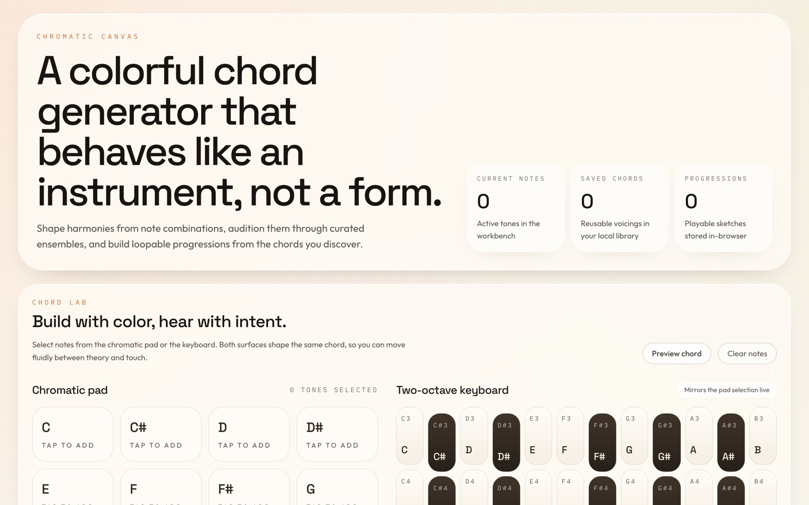

# Interactive Chord Generator

[](https://github.com/yehudalevy-collab/Interactive-chord-generator/actions/workflows/ci.yml)

A browser-based music workspace for building chords from individual notes, shaping them with voicing controls, auditioning them through four synthesized instruments, and arranging them into loopable progressions — all powered by the Web Audio API.



## Features

- **Chromatic note selection** — pick notes from a colourful 12-note pad, a two-octave piano keyboard, or an animated chromatic circle that draws interval lines in real time.
- **Automatic chord detection** — identifies 17 chord qualities (major, minor, diminished, augmented, dominant 7th, sus2/4, add9, and more) as you select notes.
- **Voicing controls** — adjust inversion (0–3), spread (close / open), register (low / centre / high), and optional bass note to reshape any chord.
- **Four instrument presets** — Studio Piano, Warm Pad, Velvet Pluck, and String Bloom, each built from a distinct Tone.js synthesis chain.
- **Chord library** — save chords with one click; they persist in `localStorage` across sessions.
- **Progression builder** — drag-and-drop arrangement lane with per-step beat control, adjustable tempo, ensemble selection, and loop toggle.
- **8 foundation presets** — Pop, Jazz, Classic, Emotional, 50s, Epic, Canon, and Minor Blues progressions ready to load and customise.
- **Standalone NPM package** — the chord detection, MIDI utilities, voicing engine, and playback logic live in `packages/chord-core` and can be installed independently as [`chord-engine-core`](./packages/chord-core).

## Repository structure

```text
.
├── apps/
│   └── web/                    # Vite + React 18 web application
│       ├── src/
│       │   ├── components/     # UI components (NotePad, ChromaticCircle, PianoKeyboard, etc.)
│       │   ├── store/          # Zustand state management with localStorage persistence
│       │   ├── audio/          # Thin re-exports from chord-core
│       │   ├── constants/      # App-level constants
│       │   ├── types/          # App-level TypeScript types
│       │   └── utils/          # App-level utility re-exports
│       └── ...
├── packages/
│   └── chord-core/             # Standalone chord logic + audio engine (publishable to NPM)
│       └── src/
│           ├── index.ts        # Public API barrel
│           ├── chord-logic.ts  # Chord detection, MIDI conversion, preset progressions
│           ├── engine.ts       # Tone.js playback engines (ChordEngine, AudioEngine)
│           ├── constants.ts    # Pitch classes, colours, interval labels
│           ├── types.ts        # Shared TypeScript types
│           └── progression.ts  # Progression timing and event scheduling
├── package.json                # Workspace root
├── tsconfig.json               # TypeScript project references
└── LICENSE                     # CC BY 4.0
```

## Getting started

### Prerequisites

- **Node.js** 18+ and **npm** 9+

### Install and run

```bash
git clone https://github.com/yehudalevy-collab/Interactive-chord-generator.git
cd Interactive-chord-generator
npm install
npm run dev
```

The dev server starts at **http://localhost:5173**.

### Build for production

```bash
npm run build
```

Output lands in `apps/web/dist`.

### Run tests

```bash
npm run test
```

## Using the standalone package

The core logic is published separately so you can use chord detection, MIDI helpers, and playback in your own projects without pulling in the React UI.

```bash
npm install chord-engine-core tone
```

```ts
import {
  identifyChord,
  buildChordMidi,
  analyzeChord,
  resolveChordVoicing,
  ChordEngine,
} from "chord-engine-core";

// Detect a chord from pitch classes
const name = identifyChord([0, 4, 7]);       // → "C Major"

// Build MIDI notes for A minor
const midi = buildChordMidi(9, "Minor");      // → [57, 60, 64]

// Full analysis with voicing
const analysis = analyzeChord(["C", "E", "G"], {
  inversion: 1,
  spread: "open",
  registerShift: "center",
  bassPitchClass: "auto",
});

// Play a chord
const engine = new ChordEngine();
engine.playChord([60, 64, 67], "piano", 1.5);
```

See [`packages/chord-core/README.md`](./packages/chord-core/README.md) for the full API reference.

## Tech stack

| Layer | Technology |
|-------|-----------|
| UI framework | React 18 + TypeScript |
| Build tool | Vite 5 |
| Styling | Tailwind CSS 3 (custom sand/ember/ink palette) |
| State | Zustand 5 with `localStorage` persistence |
| Audio | Tone.js 15 (Web Audio synthesis) |
| Animation | Framer Motion |
| Testing | Vitest + Testing Library |
| Monorepo | npm workspaces |

## How it works

1. **Select notes** — tap pitch classes on the NotePad, piano keyboard, or chromatic circle. The store tracks your selection as a `PitchClass[]` array.
2. **Detect the chord** — `analyzeChord()` computes intervals from the root, matches against 17 known chord patterns, and returns the best match with a confidence score.
3. **Shape the voicing** — inversion rotates the lowest notes up, spread doubles the interval gaps, register shifts the entire voicing by octave, and the bass note override places any pitch class at the bottom.
4. **Audition** — `ChordEngine` builds a `PolySynth` per instrument preset and triggers all MIDI notes simultaneously through a compressor/master chain.
5. **Build a progression** — saved chords are dragged into the arrangement lane. `buildProgressionPlayback()` converts steps and beat counts into timed events that `Tone.Transport` schedules for sequential playback with optional looping.

## Author

**Yehuda Levy** — [github.com/yehudalevy-collab](https://github.com/yehudalevy-collab)

## License

This project is licensed under **Creative Commons Attribution 4.0 International (CC BY 4.0)**.

You are free to share and adapt the material for any purpose, including commercially, as long as appropriate credit is given.

Full licence text: [creativecommons.org/licenses/by/4.0](https://creativecommons.org/licenses/by/4.0/)
